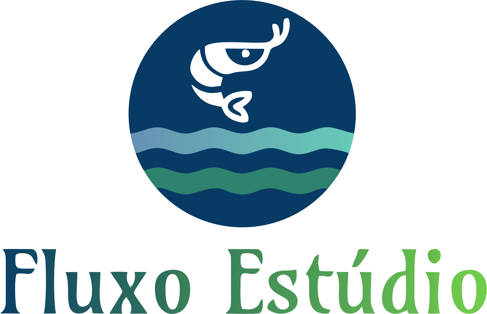
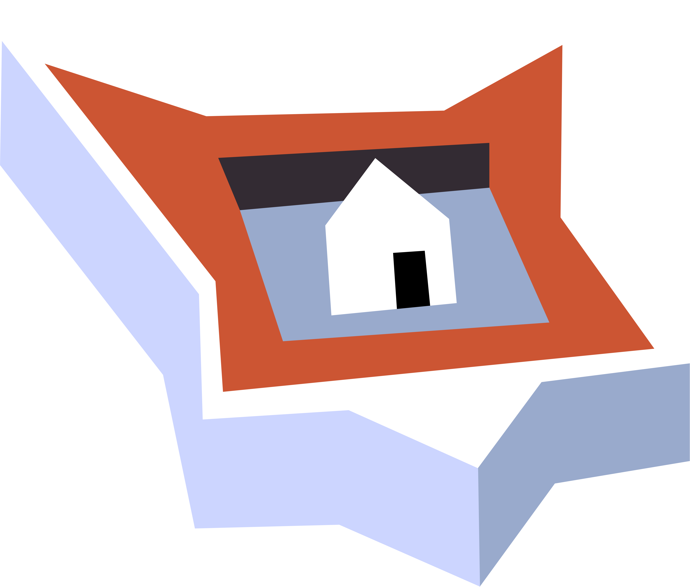
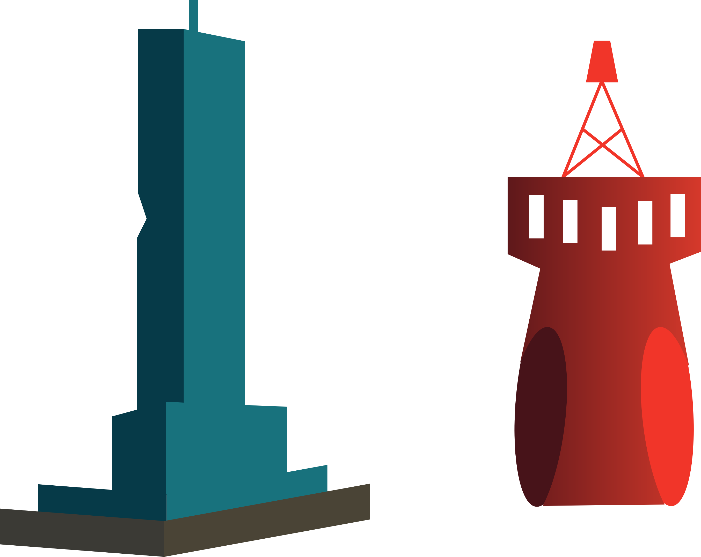
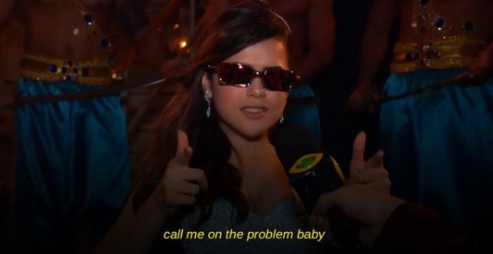

# QUEM SOU EU?

Então... Meu nome é **Thaynan Medeiros**, sou **potiguar**, tenho **19 anos**, sou **Técnico em Programação de Jogos Digitais** pelo **IFRN**, com **habilidades** na **elaboração de artes vetoriais** e em **design gráfico**, e atualmente estou **cursando Letras - Língua Portuguesa** na **UFRN**.

* **CONTATO**

> E-mail: thaynanmsilva@gmail.com

* **CURRÍCULO LATTES**

> [Thaynan Medeiros da Silva](http://lattes.cnpq.br/1310177915937354)

* **REDES SOCIAIS**

> [Instagram: thay.mdrs](https://www.instagram.com/thay.mdrs)  
> [YouTube: Thaynan Medeiros](https://www.youtube.com/channel/UCcRV_fDMn7_51ULNUNj8Ebw)  
> [GitHub: ThaynanMedeiros](https://github.com/ThaynanMedeiros)  
> [Behance: thaynanmedeiros](https://www.behance.net/thaynanmedeiros)  
> [ArtStation: thay_mdrs](https://www.artstation.com/thay_mdrs)  

* * *

## PORTFÓLIO

_Projetos desenvolvidos no decorrer do curso de Programação de Jogos Digitais (IFRN)_

**NOTAS**:
- Meus jogos são desenvolvidos através da _game engine_ Construct 2;
- Na produção de jogos, prefiro ficar com as artes do que com a programação;
- Geralmente, faço as artes no CorelDRAW;
- Sou viciadíssimo em um degradê.

### MAPA DE INFLUÊNCIA

### JOGOS

1. [BFR: Black Friday Run](https://thaynanmedeiros.github.io/BFR/): A partir da proposta do professor Marcelo de Barros, de elaborar um jogo digital sobre o tema cultura, foi desenvolvido pelos alunos Thaynan Medeiros da Silva e Maria Eduarda de Lima Freire o "Black Friday Run", baseado na cultura de consumo, já que a Black Friday representa um dos maiores eventos de incentivo ao consumo de massa na atualidade.  

    - A partir da proposta do professor Marcelo de Barros, de elaborar um jogo digital sobre o tema cultura, foi desenvolvido pelos alunos Thaynan Medeiros da Silva e Maria Eduarda de Lima Freire o "Black Friday Run", baseado na cultura de consumo, já que a Black Friday representa um dos maiores eventos de incentivo ao consumo de massa na atualidade.  

2. [Quem Tem Boca Vai a Roma](https://thaynanmedeiros.github.io/QTBVAR2/)

3. [Potengi: O Quiz](https://mrbtrzmoraes.github.io/Quiz1/)

4. ANTIBODY DEFENSE

5. [A Botija (MOCKUP)](https://youtu.be/Q2WM7h9t8Gk)  

    - O mockup do jogo "A Botija" foi desenvolvido com as informações e restrições que o professor Marcelo de Barros apresentou, um jogo com pixel art, em grid e com a temática mistério. O vídeo apresentado fez parte da composição da nota do quarto bimestre na disciplina de Oficina de Jogos e foi desenvolvido pelos alunos Thaynan Medeiros da Silva e Maria Beatriz Nogueira de Moraes.  

6. **[Rio Grande - A História (projeto de conclusão de curso)](https://mrbtrzmoraes.github.io/RioGrande/)**  

    - O jogo "Rio Grande - A História" foi desenvolvido como projeto final do curso de Programação de Jogos Digitais, ofertado pelo IFRN - _Campus_ Ceará-Mirim, para auxiliar como ferramenta no processo de ensino-aprendizagem da História do período colonial da capitania do Rio Grande. O projeto foi desenvolvido por Amnésia Estúdio, o qual é composto pelos alunos Maria Beatriz Nogueira de Moraes, responsável pela programação; Thaynan Medeiros da Silva, responsável pelas artes, e Maria Eduarda de Lima Freire, responsável pelo game design e áudios.  

### ARTES

- Potengi: O Quiz  

  - Fluxo Estúdio - Logo    
  
  
  - Catamarã    
  
  
  - Ponte Newton Navarro    
  
  
  - Fortaleza dos Reis Magos    
  
  
  - Faróis da Boca da Barra    
  

### PROJETOS

- Jogos Digitais Como Fonte De Conhecimento Da Cultura Budista: Em Foco O Nirvana;
- Rio Grande: A História - Uma Ferramenta de Ensino Aprendizagem Sobre a História do Rio Grande do Norte (projeto de conclusão de curso).

### APRESENTAÇÕES EM EVENTOS

- The Cups Song (apresentação cultural na I Secitex que aconteceu no IFRN - _Campus_ Santa Cruz em 2015);  
- The Cups Song (apresentação no aniversário de 2 anos do IFRN - _Campus_ Ceará-Mirim),  
  - [Vídeo da apresentação](https://www.youtube.com/watch?v=Gy5uhUjbOJc);  
- The Cups Song (apresentação cultural na II Secitex que aconteceu no IFRN - _Campus_ Parnamirim em 2016);  
- Jogos Digitais Como Fonte De Conhecimento Da Cultura Budista: Em Foco O Nirvana (apresentação no formato Banner na I Expotec do IFRN - _Campus_ Ceará-Mirim).

* * *

Agora que você conheceu e sabe o que eu faço,

**(: GIVE ME A JOB, PLEASE :)**

  
Meme da Maísa Silva "Chama no probleminha" — Foto: Reprodução/Twitter

* * *
