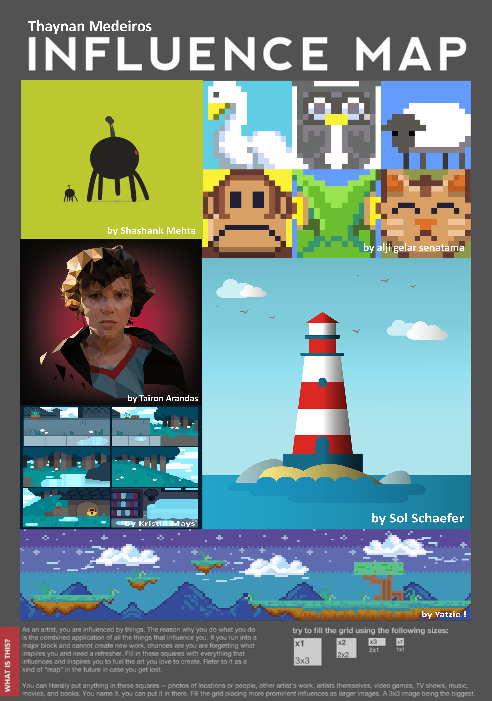
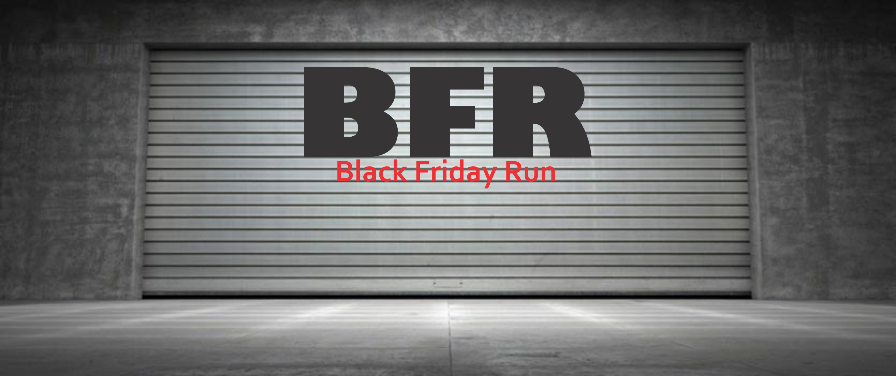
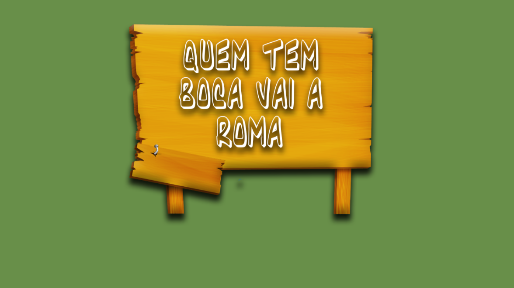
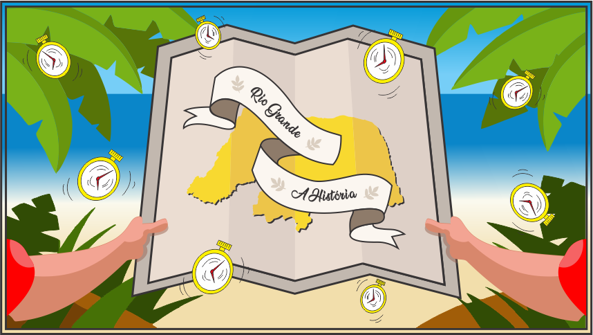

# QUEM SOU EU?

Então... Meu nome é **Thaynan Medeiros**, sou **potiguar**, tenho **21 anos**, sou **Técnico em Programação de Jogos Digitais** pelo **IFRN**, com **habilidades** na **elaboração de artes vetoriais** e em **design gráfico**, e atualmente estou **cursando Letras - Língua Portuguesa** na **UFRN**, com **interesse** nas áreas de **Leitura e Produção de Texto**, **Literatura** e **Linguística**.  

* **CURRÍCULO LATTES**

> [Thaynan Medeiros da Silva](http://lattes.cnpq.br/1310177915937354)

* **REDES SOCIAIS**

> [LinkedIn: thaynanmedeiros](https://www.linkedin.com/in/thaynanmedeiros)  
> [Instagram: thay.mdrs](https://www.instagram.com/thay.mdrs)  
> [YouTube: Thaynan Medeiros](https://www.youtube.com/channel/UCcRV_fDMn7_51ULNUNj8Ebw)  
> [Behance: thaynanmedeiros](https://www.behance.net/thaynanmedeiros)  
> [ArtStation: thay_mdrs](https://www.artstation.com/thay_mdrs)  

* * *

## PORTFÓLIO

_Projetos desenvolvidos no decorrer do curso de Programação de Jogos Digitais (IFRN)_

**NOTAS**:
- Meus jogos são desenvolvidos através da _game engine_ Construct 2;
- Na produção de jogos, geralmente fico com as artes;
- E geralmente, faço/monto as artes no CorelDRAW;
- Sou viciadíssimo em um degradê.

### MAPA DE INFLUÊNCIA

### JOGOS

**_OBSERVAÇÃO: Os jogos apresentados a seguir são apenas para PC._**

1. [BFR: Black Friday Run](https://thaynanmedeiros.github.io/BFR/)  A partir da proposta do professor Marcelo de Barros de elaborar um jogo digital de plataforma sobre o tema cultura, foi desenvolvido pelos alunos Thaynan Medeiros da Silva e Maria Eduarda de Lima Freire o "Black Friday Run", baseado na cultura de consumo, já que a Black Friday representa um dos maiores eventos de incentivo ao consumo de massa na atualidade. O projeto apresentado fez parte da composição da nota do primeiro bimestre na disciplina de Oficina de Jogos.  

2. [Quem Tem Boca Vai a Roma (protótipo)](https://thaynanmedeiros.github.io/QTBVAR2/)  A partir da proposta do professor Marcelo de Barros de elaborar um jogo digital de clique e toque sobre o tema mensagem, foi desenvolvido pelos alunos Thaynan Medeiros da Silva e Elicia Porpino da Silva o "Quem Tem Boca Vai a Roma", baseado na forma errônea da expressão popular de nomenclatura parecida e também na ideia de que as pessoas precisam da comunicação para conseguirem atingir os seus objetivos, como por exemplo, em um deslocamento a determinado local através de placas de sinalização e até mesmo por meio de informações de outras pessoas. O projeto apresentado fez parte da composição da nota do segundo bimestre na disciplina de Oficina de Jogos.  

3. [Potengi: O Quiz (protótipo)](https://mrbtrzmoraes.github.io/Quiz1/)  A partir da proposta do professor Marcelo de Barros de elaborar um jogo digital de tema livre, foi desenvolvido pelos alunos Maria Beatriz Nogueira de Moraes, Thaynan Medeiros da Silva e Maria Eduarda de Lima Freire o "Potengi: O Quiz", que aborda questões sobre aspectos diversos voltados ao rio Potengi e outros elementos que estão a sua volta. O projeto apresentado fez parte da composição da nota do terceiro bimestre na disciplina de Oficina de Jogos.  

4. ANTIBODY DEFENSE (Projeto Integrador)  
  
Neste projeto, foram integradas as disciplinas de Motores de Jogos e Biologia através do desenvolvimento de um jogo digital no estilo tower defense baseado na temática “vírus e bactérias”. Também foi aplicada uma pequena abordagem do assunto imunologia, que é um ramo da biologia, ao jogo. O projeto fez parte da composição de nota na disciplina de Seminário de Orientação de Projeto Integrador e foi desenvolvido pelos alunos Maria Beatriz Nogueira de Moraes, Maria Eduarda de Lima Freire, Matheus Ricardo de Araújo Teixeira e Thaynan Medeiros da Silva.  

5. [A Botija (MOCKUP)](https://youtu.be/Q2WM7h9t8Gk)  O mockup do jogo "A Botija" foi desenvolvido com as informações e restrições que o professor Marcelo de Barros apresentou, um jogo com pixel art, em grid e com a temática mistério; elaborado com base em contos populares regionais, segundo Luís da Câmara Cascudo. O vídeo apresentado fez parte da composição da nota do quarto bimestre na disciplina de Oficina de Jogos e foi desenvolvido pelos alunos Thaynan Medeiros da Silva e Maria Beatriz Nogueira de Moraes.  

6. **[Rio Grande - A História (projeto de conclusão de curso)](https://mrbtrzmoraes.github.io/RioGrande/)**  O jogo "Rio Grande - A História" foi desenvolvido como projeto final do curso de Programação de Jogos Digitais, ofertado pelo IFRN - _Campus_ Ceará-Mirim, para auxiliar como ferramenta no processo de ensino-aprendizagem da História do período colonial da capitania do Rio Grande. O projeto foi desenvolvido por Amnésia Estúdio, o qual é composto pelos alunos Maria Beatriz Nogueira de Moraes, responsável pela programação, Thaynan Medeiros da Silva, responsável pelas artes, e Maria Eduarda de Lima Freire, responsável pelo game design e áudios.  

### PROJETOS

- Jogos Digitais Como Fonte De Conhecimento Da Cultura Budista: Em Foco O Nirvana;
- ANTIBODY DEFENSE: Ferramenta Digital Para Aprendizagem Sobre Vírus, Bactérias e Anticorpos;
- Rio Grande: A História - Uma Ferramenta de Ensino Aprendizagem Sobre a História do Rio Grande do Norte (projeto de conclusão de curso).

### APRESENTAÇÕES EM EVENTOS

- The Cups Song (apresentação cultural na I Secitex que aconteceu no IFRN - _Campus_ Santa Cruz em 2015);  
- The Cups Song (apresentação no aniversário de 2 anos do IFRN - _Campus_ Ceará-Mirim),  
  - [Vídeo da apresentação](https://www.youtube.com/watch?v=Gy5uhUjbOJc);  
- The Cups Song (apresentação cultural na II Secitex que aconteceu no IFRN - _Campus_ Parnamirim em 2016);  
- Jogos Digitais Como Fonte De Conhecimento Da Cultura Budista: Em Foco O Nirvana (apresentação no formato Banner na I Expotec do IFRN - _Campus_ Ceará-Mirim).

* * *
