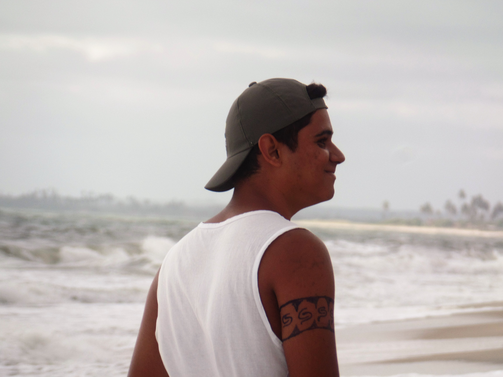
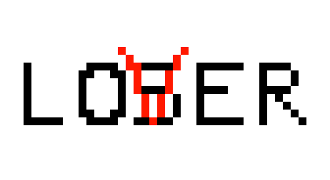

# QUEM SOU EU?

Então... Meu nome é **Thaynan Medeiros**, sou **papa-jerimum**, tenho **17 anos** e atualmente estou cursando o **3º período** de **Programação de Jogos Digitais** (**IFRN**).

**~~Palavra-chave: mouthbreather~~**

* **CONTATO**

> Email: thaynan41@hotmail.com

* **REDES SOCIAIS**

> [Instagram: thaynan_ms](https://www.instagram.com/thaynan_ms)  
> [Pinterest: thaynan_ms](https://www.pinterest.com/thaynan_ms)  
> [ArtStation: thaynan_ms](https://www.artstation.com/thaynan_ms)  

* * *

# PORTFOLIO

_Projetos desenvolvidos no decorrer do curso Programação de Jogos Digitais (IFRN)_

**NOTAS**:
- Meus jogos são desenvolvidos através do Construct 2;
- Na produção de jogos, prefiro ficar com as artes do que com a programação;
- Geralmente, faço as artes no CorelDRAW;
- Sou viciado e apaixonado por um degradê. ~~Degradê é a minha religião.~~

## MAPA DE INFLUÊNCIA

_(título autodidático)_

### JOGOS

[BFR: Black Friday Run](https://thaynanmedeiros.github.io/BFR/)

[Quem Tem Boca Vai a Roma](https://thaynanmedeiros.github.io/QTBVAR2/)

[Potengi: O Quiz](https://mrbtrzmoraes.github.io/Quiz1/)

## Artes  

  

## Apresentações
* Aula de Multimidia
* Aula de Motores
* Aula de Empreendedorismo  

1. Durval  
2. Marcelo  
3. Idel

## Projetos

* * *

** negrito

_ italico

~~ riscado

   dois espaço p/ pular linha
 3* adciona uma linha horizontal
 #s uma ou mais hashtag criam capitulos ou sub capitulos  
 
 
 * * *
