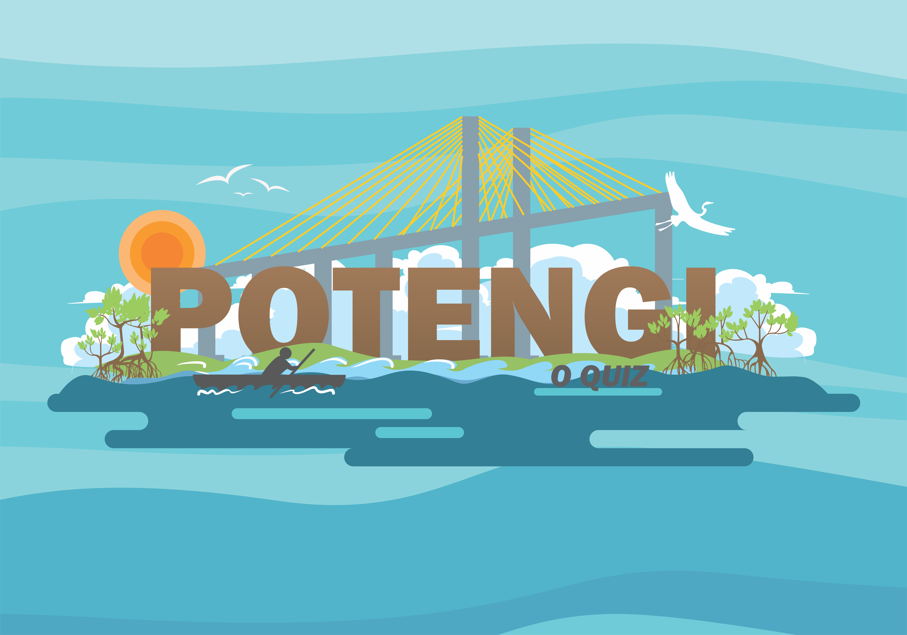
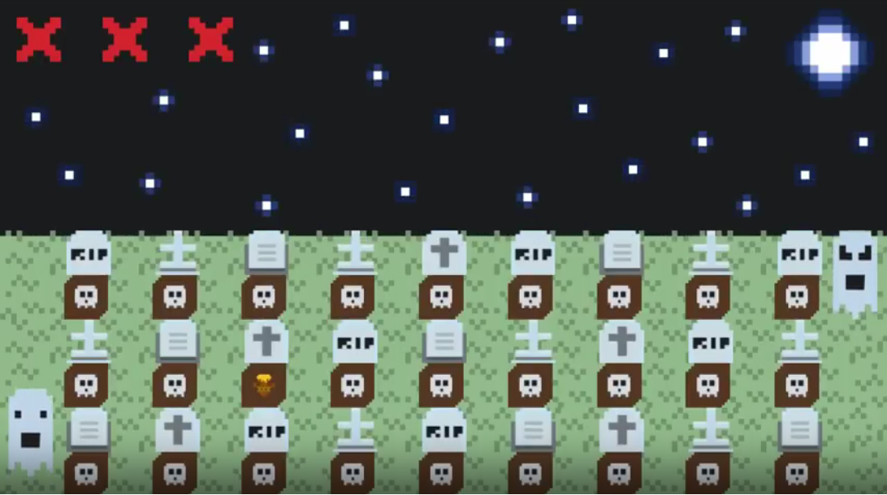

# QUEM SOU EU?

Então... Meu nome é **Thaynan Medeiros**, sou **potiguar** e sou **Técnico em Programação de Jogos Digitais** pelo **IFRN**.

* **CONTATO**

> E-mail: thaynanmsilva@gmail.com

* **LATTES**

> [http://lattes.cnpq.br/1310177915937354](http://lattes.cnpq.br/1310177915937354)

* **REDES SOCIAIS**

> [Instagram: thay.mdrs](https://www.instagram.com/thay.mdrs)  
> [ArtStation: thay_mdrs](https://www.artstation.com/thay_mdrs)  

* * *

## PORTFÓLIO

_Projetos desenvolvidos no decorrer do curso de Programação de Jogos Digitais (IFRN)_

**NOTAS**:
- Meus jogos são desenvolvidos através da _game engine_ Construct 2;
- Na produção de jogos, prefiro ficar com as artes do que com a programação;
- Geralmente, faço as artes no CorelDRAW;
- Sou viciadíssimo em um degradê.

### MAPA DE INFLUÊNCIA

### JOGOS

1. [BFR: Black Friday Run](https://thaynanmedeiros.github.io/BFR/)

2. [Quem Tem Boca Vai a Roma (em construção)](https://thaynanmedeiros.github.io/QTBVAR2/)

3. [Potengi: O Quiz (em construção)](https://mrbtrzmoraes.github.io/Quiz1/)

4. ANTIBODY DEFENSE (em construção)

5. [A Botija (MOCKUP)](https://youtu.be/Q2WM7h9t8Gk)

6. **[Rio Grande - A História (projeto de conclusão de curso)](https://mrbtrzmoraes.github.io/RioGrande/)**

### ARTES

- Potengi: O Quiz  

  - Fluxo Estúdio - Logo    
  
  
  - Catamarã    
  
  
  - Ponte Newton Navarro    
  
  
  - Fortaleza dos Reis Magos    
  
  
  - Faróis da Boca da Barra    
  

### PROJETOS

- Jogos Digitais Como Fonte De Conhecimento Da Cultura Budista: Em Foco O Nirvana;
- Rio Grande: A História - Uma Ferramenta de Ensino Aprendizagem Sobre a História do Rio Grande do Norte (projeto de conclusão de curso).

### APRESENTAÇÕES EM EVENTOS

- The Cups Song (apresentação cultural na I Secitex que aconteceu no IFRN - _Campus_ Santa Cruz em 2015);  
- The Cups Song (apresentação no aniversário de 2 anos do IFRN - _Campus_ Ceará-Mirim),  
  - [Vídeo da apresentação](https://www.youtube.com/watch?v=Gy5uhUjbOJc);  
- The Cups Song (apresentação cultural na II Secitex que aconteceu no IFRN - _Campus_ Parnamirim em 2016);  
- Jogos Digitais Como Fonte De Conhecimento Da Cultura Budista: Em Foco O Nirvana (apresentação no formato Banner na I Expotec do IFRN - _Campus_ Ceará-Mirim).

* * *

Agora que você conheceu um pouco do que eu faço,

**:) GIVE ME A JOB, PLEASE :)**

* * *
